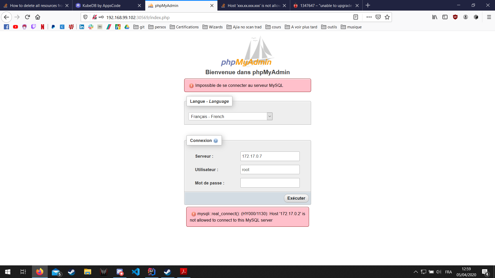

# TP Kubernetes
Par Verner BOISSON, Antoine-Dominique STEFANAGGI et Florian LAFUENTE

## Etapes d'installation
```
# Génération de la VM
$ minikube start

# Installation de KubeDB
$ helm repo add appscode https://charts.appscode.com/stable/
$ helm repo update
$ helm install kubedb-operator appscode/kubedb --namespace kube-system
$ helm install kubedb-catalog appscode/kubedb-catalog --version 0.12.0 --namespace kube-system

# Vérifier installation de KubeDB (kubedb-operator est censé être présent)
$ kubectl describe deployments --namespace kube-system
```

## Découpage de namespace
### Proposer un découpage
3 namespaces:
- Base de donnée
- Wordpress
- Monitoring

### Créer les namespaces avec leurs quotas
Pour la création des quotas, nous avons décidé de nous baser sur les
spécifications officielles.

Wordpress v5.2+ recommendations:
- Espace de stockage supérieur à 1GB
- RAM supérieur à 512MB
- Processeur supérieur à 1GHz

MySQL recommendations minimales:
- 2 CPU
- 2GB RAM

MySQL recommendations:
- 4 CPU
- 8GB RAM

Grafana recommendations minimales:
- 1 CPU
- 255MB RAM

## KubeDB
### Mise en palce de MySQL avec KubeDB

Nous allons installer une base MySQL à l'aide de KubeDB (précédemment installé). Pour visualiser notre base nous allons aussi mettre en place
un service phpMyAdmin :

```
# Mise en place de la configuration
$ kubectl.exe apply -f ./conf/database/namespace.yml
namespace/db created
$ kubectl.exe apply -f ./conf/database/myadmin.yml
deployment.apps/myadmin created
service/myadmin created
$ kubectl.exe apply -f ./conf/database/mysql.yml
mysql.kubedb.com/mysql created
```

On vérifie que les pods de phpMyAdmin et MySQL sont présents

```
$ kubectl.exe get pods -n db
NAME                       READY   STATUS    RESTARTS   AGE
myadmin-58cd6c758c-bkf68   1/1     Running   0          46s
mysql-0                    1/1     Running   0          37s
```

Pour faire la liaison entre phpMyAdmin et MySQL il nous faut les identifiants de connexion et l'IP de MySQL

``` 
$ kubectl get pods mysql-0 -n demo -o yaml -n db | grep podIP
  podIP: 172.17.0.2
  podIPs:
$ kubectl get secrets -n db mysql-auth -o jsonpath='{.data.\username}' | base64 -d
root
$ kubectl get secrets -n db mysql-auth -o jsonpath='{.data.\password}' | base64 -d
_YFjm8AlqL7omjyq
```

On se connecte maintenant sur phpMyAdmin :
```
$ minikube service myadmin -n db --url
http://192.168.99.102:30569
```

Cependant nous avons une erreur lors de la connexion :



Nous avons un problème pour lancer des commandes sur notre pod mysql (le pod n'est pas en erreur) :

```
# Probleme pour joindre mysql qui bloque la suite 
$ kubectl.exe exec mysql-0 -it -n db -- mysql -u root --password=_YFjm8AlqL7omjyq
error: unable to upgrade connection: container not found ("mysql")
```

### Comprendre le principe de CRD (custom resource definition)
Un CRD permet de créer notre propre ressource sur kubernetes à la place
des types `Deployment`, `Pod`, `Service`, ...

C'est sur des CRD que se base KubeDB pour nous proposer le type `MySQL`.

## Wordpress
On commence par créer un fichier `kustomization.yml` pour avoir notre mot de passe et charger les ressources a deployer.

``` 
$ kubectl apply -f ./conf/wordpress/namespace.yml
namespace/wordpress created
resourcequota/quota-wordpress created
$ kubectl.exe apply -k ./conf/wordpress/
secret/mysql-pass-km99f6b4f8 created
service/wordpress created
deployment.apps/wordpress created
persistentvolumeclaim/wp-pv-claim created
``` 
On vérifie que l'installation s'est bien passé
Le mysql-pass n'est pas generer, on a un problème inconnu ici (présent dans aucun namespace)
```
$ kubectl get secrets -n wordpress
NAME                    TYPE                                  DATA   AGE
default-token-dzrgd     kubernetes.io/service-account-token   3      24m

$ kubectl get pvc -n wordpress
NAME             STATUS   VOLUME                                     CAPACITY   ACCESS MODES   STORAGECLASS   AGE
mysql-pv-claim   Bound    pvc-eb6e4870-d923-4dab-a61d-d98fb7158e58   20Gi       RWO            standard       10s
wp-pv-claim      Bound    pvc-ad1561d7-54e5-45d1-add3-cc8857584004   1Gi        RWO            standard       18m

$ kubectl get services -n wordpress
NAME              TYPE           CLUSTER-IP      EXTERNAL-IP   PORT(S)        AGE
wordpress         LoadBalancer   10.96.120.189   <pending>     80:30190/TCP   48s
wordpress-mysql   ClusterIP      None            <none>        3306/TCP       48s

# Le pod qui est censé se générer n'est pas là
$ kubectl get pods -n wordpress
No resources found in wordpress namespace.
```

Vérifions que wordpress est bien lancé :
```
$ minikube service wordpress -n wordpress --url
http://192.168.99.102:30432
```

Vu que les étapes d'avant se sont mal passés, nous n'avons même pas accès à la page.
On a essayé de regarder les logs des services : ils ne se lancaient pas à cause d'une erreur de réplication. Il ne prenait pas en considération notre `replicas: 2`.

Erreur : 
``` 
    ----           ------  ------
  Available      False   MinimumReplicasUnavailable
  Progressing    True    ReplicaSetUpdated
OldReplicaSets:  <none>
NewReplicaSet:   wordpress-mysql-64b45bd46 (2/2 replicas created)
Events:
  Type    Reason             Age   From                   Message
  ----    ------             ----  ----                   -------
  Normal  ScalingReplicaSet  4s    deployment-controller  Scaled up replica set wordpress-mysql-64b45bd46 to 2

```

## RBAC Politique de sécurité des systèmes d'information : gestion de rôles.

### 1. Objectif

Le RBAC découle de IBAC (Identity Based Access Control).
L'idée est de regrouper les utilisateurs en rôle pour leur donner l'accès 
aux ressources ou d'identifier les ressources qui sont associés simultanément, et les regrouper afin d'en définir un rôle.  

Pour la protection de notre système d'information nous allons définir notre gestion autour de RBAC afin de donner accès à certaines ressources uniquement aux personnes qui en ont le besoin.

Il n'est pas sûr que cette politique gère efficacement notre système d'information de façon pérenne, elle est donc susceptible au changement.

### 2.Visée

1. Tout employé, contractant ou individu ayant accès aux systèmes ou données de notre entreprise.

2. Définition des données à protéger 

- Informations personnelles identifiables (PII)
- Données financières
- Données sensibles / à diffusion limitée
- Données confidentielles
- Adresses IP

### Définition des rôles et de leurs accès

##### Administrateur de cluster

Rôle empirique, a les droits sur tout et définit les rôles RBAC.

##### Sysops

Rôle descendant directement de l'administrateur de cluster, n'a pas les droits de définition de rôles RBAC, donne accès à :
- Base de données, lecture écriture.
- Wordpress, lecture écriture.
- Monitoring, lecture écriture.

##### dev

Le rôle de développeur donne accès à :
- Base de données, lecture seule.
- Wordpress, lecture écriture.

##### client

Le rôle de client donne accès à :
- Wordpress, lecture seule.


## Monitoring
Utilisation de grafana et prometheus